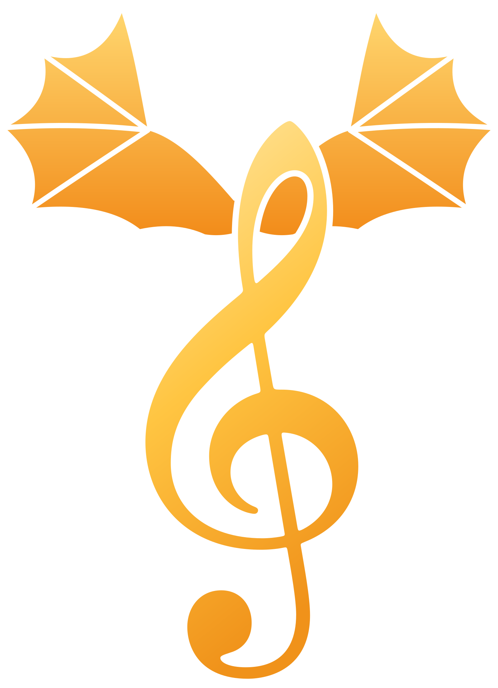

# Clefwing



A Duolingo-style note-reading game for a young pianist, built for a **normal acoustic piano**: the
iPad sits on the music stand and listens through its microphone. No MIDI needed.

**Play it:** https://josephrich.github.io/NoteQuest/. In Safari on the iPad, use *Share › Add to
Home Screen* for a full-screen app with the dragon icon.

See [`docs/PLAN.md`](docs/PLAN.md) for the product plan and roadmap, and
[`docs/APP_STORE.md`](docs/APP_STORE.md) for the plan to publish it on the App Store.

## What's in it (Phase 1)

- **Onboarding**: the player's name and a name for their dragon (both kept on the device only),
  plus a quick "play any note" mic check.
- **Players**: everyone in the family can have their own player, each with its own dragon, streak,
  gems, prizes and progress. **Who's playing?** appears at launch when there's more than one player,
  and the 👤 button on the home screen switches player. Grown-ups can add and remove players. The
  piano tuning and the daily reminder are shared by everyone on the device. An existing save
  becomes the first player automatically.
- **Path of lessons** in five units: Treble Landmarks, Bass Landmarks, Both Hands, Ledger Lines, and
  Steps, Skips & Leaps. New notes are taught relative to landmark notes (middle C, the G line, the F
  line, treble and bass C).
- **Interval reading** (Unit 5): the skill that stops note-by-note decoding. Steps (line to space),
  skips (line to line), 4ths, 5ths and octaves, in both clefs. He names the jump between two notes,
  plays a pair when told only the first note, and plays short four-note melodies built from the
  jumps he knows.
- **Mini-lessons** (📖 on the path): 11 short explainers placed just before the lessons that need
  them. They cover the staff, counting from landmarks, FACE and Every Good Boy, the bass clef and its
  spaces, the grand staff, ledger lines, and steps, skips, leaps and octaves. Each has a few cards
  with pictures on the staff, quick tap questions and "now play it" moments. Wrong answers just
  explain and let him retry. The first read earns a chest; re-reading earns a little XP. Guides
  never lock the path, so lessons he's already reached stay open.
- **Show more, say less, and read aloud**: explainer and new-note cards show the matching keys lit
  up on a small piano keyboard under the staff (middle C always has a dot), and every card is one
  short sentence. A 🔊 button reads explanations and prompts aloud with the device's built-in voice.
  Grown-ups can switch on **Read aloud automatically** for younger players. Lines play natural
  recordings made with OpenAI text-to-speech where they exist (see *Voice recordings* below), and
  the device's voice otherwise. Note listening pauses
  while the voice talks, and note letters are pronounced as letters ("A" as "ay").
- **Clear modes**: tapping (orange, 👆), playing (blue, 🎹) and learning (purple, 📖) each have
  their own banner and background tint. The banner pops and chimes when the mode changes, and
  questions come in blocks so the mode changes less often.
- **Challenge types**:
  - *Meet the note*: a tip explaining where the note sits
  - *What note is this?*: tap the letter
  - *Play this note*: heard through the mic
  - *Play these notes in order*: three-note bursts
- **Adaptive practice**: every note's reading time and accuracy is tracked, and slow or missed
  notes come up more often.
- **Daily Review**: a fresh 15-challenge mix every day from all the notes learned so far. It
  focuses on the 3 trickiest notes (slowest or most missed), which are named on the home screen.
  It never runs out, even after the course is finished.
- **Rewards**:
  - XP, with ⚡ lightning bonuses for fast reads and 🔥 combo bonuses
  - A treasure chest after each lesson with a random prize: Common (5–12 gems), Rare (15–25), Epic (30–50) or Legendary (100 gems + a streak freeze). A perfect lesson improves the odds, and four Common chests in a row guarantee a better one
  - A daily goal (10 minutes by default) that builds a 🔥 streak, protected by streak freezes 🧊
    (one earned per week of streak)
- **Gem shop**:
  - Dragon colours and accessories to try on and buy (hats, crown, glasses, bow tie…)
  - Streak freezes
  - Real-world **prizes** a grown-up sets up (e.g. "Choose Friday dinner"). The child claims one
    with gems and the grown-up marks it as given
  - Chest odds are published in the shop. Gems can only be earned, never bought
- **Mistakes are gentle**: no lives. A wrong name is shown and asked again later. A wrong note says
  what was heard, with a hint after two misses and the answer after three.
- **Grown-ups area** (behind a times-table question):
  - 14-day practice chart
  - Per-note reading speed
  - Piano tuning
  - Settings and reset
  - **Unlock every lesson**: lets him skip ahead, or lets a tester try later units
- The original **mic test page** is at `/mic-test.html` for troubleshooting.

Progress lives in Safari's local storage on the device. Nothing is sent anywhere.

## Development

```bash
npm install
npm run dev        # http://localhost:5173 (add ?debug to enable window.__nq.note(midi) for testing)
npm test           # unit tests: detection, lessons, scoring, streaks
npm run build      # type-check and build to dist/
```

Pushing to `main` runs the tests, builds, and publishes `dist/` to the `gh-pages` branch
(`.github/workflows/deploy.yml`).

Safari only allows the microphone on https pages (or localhost). To try the dev server on an iPad,
use the deployed site or an https tunnel.

## How detection works

- **Single notes**: the McLeod Pitch Method (`src/engine/pitch.ts`) on a 2048-sample window. A note is
  confirmed after a detected attack plus three consistent high-clarity readings
  (`src/engine/trackers.ts`). A repeat of the same note within 250 ms counts as the same key press.
- **Voices vs piano**: talking often has a clear pitch too. A piano note's pitch is locked from the
  moment it's struck and it only fades, while a voice drifts in pitch and holds or swells in volume.
  A right note is accepted as soon as it's heard. A wrong note is only shown once it has held for
  120 ms, with its pitch steady to within 15 cents and its volume fading from an early peak. In
  synthetic tests, 0.5% of random speech passes this check, while every piano key does.
- **Chords**: verified rather than transcribed (`src/engine/chord.ts`). Every expected note's
  fundamental must be present, and at least 80% of the spectral energy must be explained by the
  harmonics of those notes.
- **Tuning**: notes are matched relative to the piano's measured A.
- **Reward sounds** are pitched above the detector's range and only play while the app isn't listening.

Field test on an iPad and an acoustic piano: 0 misjudged notes out of 41 and 0 misjudged chords out
of 34. Median detection time was 67 ms for notes and 117 ms for chords.

## Voice recordings

Every line the app reads aloud is listed in `src/voice/lines.ts`. To record them with OpenAI's
text-to-speech (about 130 short lines, costing a few cents):

```bash
npm run voices                  # records new or changed lines; asks for your OpenAI API key (hidden)
npm run voices -- --force       # re-record everything, e.g. with VOICE=nova npm run voices -- --force
npm run voices -- --dry-run     # list what would be recorded
```

Recordings go in `public/voice/` (MP3 audio named `.mpga`, which the iOS app serves reliably) and are listed in `src/voice/clips.json`; commit both. Editing a line
changes its recording's name, so the next run re-records just that line and removes the old one. A
line with no recording falls back to the device's voice. OpenAI's terms require telling users that
the voice is AI-generated (see `docs/APP_STORE.md`).

## Logo and icons

The logo is a treble clef (the real Bravura font outline) with a pair of dragon wings, in gold on
deep violet. Everything is generated from `scripts/brand/design.mjs`:

```bash
node scripts/brand/render.mjs   # rewrites public/ logo + icons and the iOS app icon/launch screen
```

## Layout

```
src/engine/   audio capture, pitch & chord detection, note events, music theory, staff drawing
src/game/     course content, lesson building, lesson rules (XP/combos), chests, shop, progress & streaks
src/platform/ device storage (swap point for native storage in the App Store build)
src/ui/       React screens: Welcome, Home, Lesson, Results, Parent; the Dragon
src/mictest/  the Phase 0 microphone test page
public/       icons and web app manifest
```
